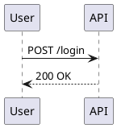

# SequenceForge

> A single-file, zero-dependency UML sequence diagram builder.
> Runs entirely in the browser. No build step, no npm install.

**[Live demo — v0.9.70](https://meatpopsci1972.github.io/sequence-builder/releases/v0.9.70/sequence-builder.html)** &nbsp;|&nbsp; **[All releases](https://github.com/MeatPopSci1972/sequence-builder/releases)**

---

## Quick start

```bash
git clone https://github.com/MeatPopSci1972/sequence-builder
cd sequence-builder
node launcher.js        # dev server with hot-reload at http://localhost:3799
```

Open `http://localhost:3799` in your browser.

---

## What it does

- **Add actors, messages, notes, fragments** via the palette or toolbar
- **Drag** messages up/down to reorder · **drag actors** left/right to reorder columns
- **Double-click** a message arrow label to edit it inline
- **Export** as PlantUML, Mermaid `sequenceDiagram`, JSON, or PNG
- **Import** JSON snapshots or raw PlantUML/Mermaid text
- **Undo/Redo** all mutations · **auto-fit** on load
- **Send to API** (Ollama / OpenAI-compatible) for diagram analysis

---

## Repository structure

| File | Purpose |
|------|---------|
| `sequence-builder.html` | Single-file app — toolbar, CSS, JS, store injected at build |
| `sequence-builder.store.js` | Store source — `build.js` syncs into HTML |
| `sequence-builder.test.js` | 99 contract tests (Suites 1–12) |
| `build.js` | Syncs store into HTML between `@@STORE-START` / `@@STORE-END` sentinels |
| `lint.js` | HTML integrity checker: button count, SVG balance, sentinels |
| `sf-server.js` | Dev server v5 (GET/PUT files, POST /build /lint /git /snapshot) |
| `launcher.js` | Hot-reload wrapper — **always use this, not `node sf-server.js`** |

---

## Dev server API

| Method | Path | Purpose |
|--------|------|---------|
| GET | `/status` | Version, git state, demos list |
| GET | `/HANDOFF.md` | AI session handoff document |
| GET | `/test` | Run build + tests, returns HTML report |
| GET | `/git-log` | Recent commits as JSON `{n, lines}` |
| POST | `/build` | Sync store into HTML |
| POST | `/lint` | Check button count, SVG balance, sentinels |
| POST | `/patch` | Server-side find-replace `{file, old, new}` |
| POST | `/snapshot?v=X.Y.Z` | Copy build into `releases/vX.Y.Z/` |
| POST | `/git` | `git add -A && commit` |
| GET/PUT | `/<file>` | Read or write any file in repo root |

---

## Running the tests

```bash
node build.js && node sequence-builder.test.js
# Expected: 99 passed | 0 failed | 99 total
```

Or via the dev server: `GET http://localhost:3799/test`

---

## UML import — supported syntax

**PlantUML:**


**Mermaid:**
```
sequenceDiagram
  participant User
  participant API
  User->>API: POST /login
  API-->>User: 200 OK
```

---

## Tech stack

Vanilla JS, SVG, HTML5 Canvas. No frameworks, no bundler, no runtime dependencies.

---

## License

MIT
